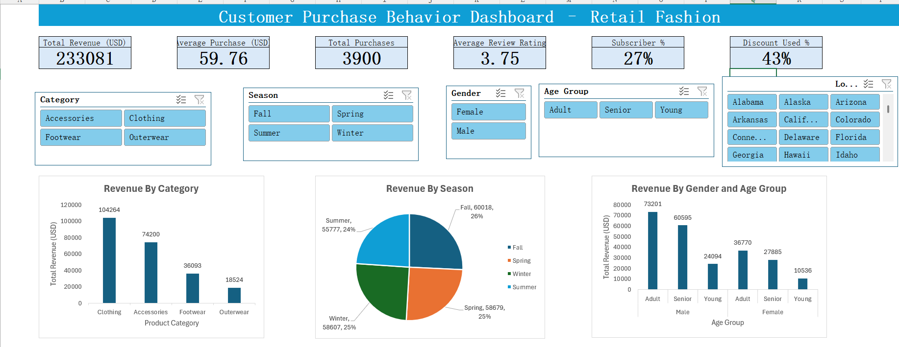
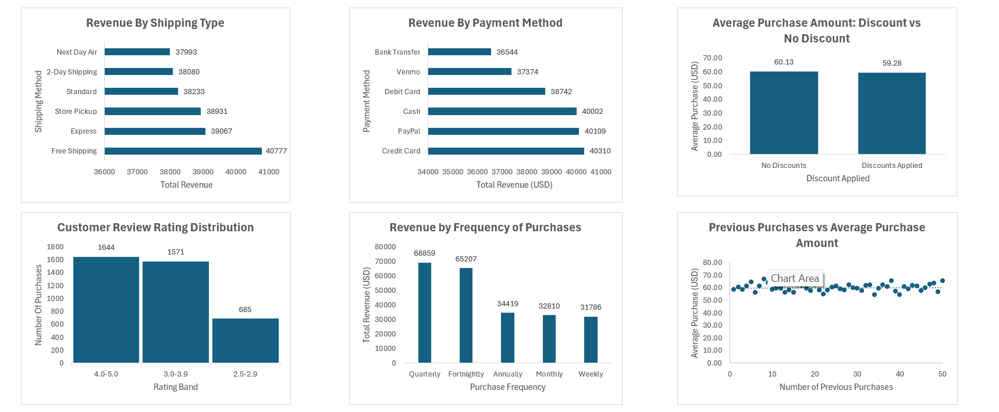
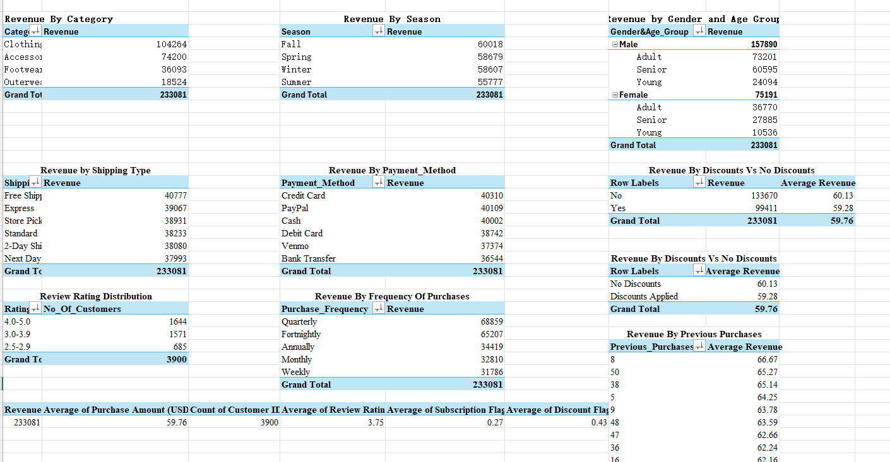

# Customer Purchase Behavior Analysis (Retail Fashion) - Excel Dashboard

## Problem Statement
A retail fashion company wants to know which customers, products and offers bring in the most revenue, so it can improve marketing, stock planning and loyalty programs.

## Dataset
- shopping_behavior_updated.csv
- 3,900 purchases, 18 columns
- Fields include: age, gender, item, category, purchase amount, location, size, color, season, review rating, subscription status, shipping type, discount applied, promo code used, previous purchases, payment method and frequency of purchases

## Tools Used
Excel Tables, Pivot Tables, Pivot Charts, Slicers, formulas, data cleaning

## Workflow
1. Cleaned the data (checked blanks and duplicates, merged repeated frequency labels)
2. Created new columns: Age Group, Rating Band, Subscription Flag, Discount Flag
3. Defined KPIs: total revenue, average purchase, total purchases, average rating, subscriber %, discount %
4. Built 9 pivot charts
5. Built an interactive dashboard with KPI cards and slicers

## Key Numbers
- Total revenue: 233,081 USD
- Average purchase: 59.76 USD
- Total purchases: 3,900
- Average review rating: 3.75
- Subscribers: 27%
- Purchases with a discount: 43%

## Dashboard

## Pivot Tables

## Key Insights
1. **Two categories carry the business.** Clothing (104,264 USD, 45%) and Accessories (74,200 USD, 32%) bring about 77% of total revenue. Outerwear is the smallest at 8%.
2. **Men bring most of the revenue, but women spend the same per order.** Men bring 68% of revenue (157,890 USD) and women 32% (75,191 USD), yet the average spend per purchase is almost equal (59.5 vs 60.2 USD). The gap comes from the number of customers, so there is room to grow among women.
3. **Adults and seniors drive revenue.** Adults (26 to 50) bring 47% of revenue and seniors (51 and above) bring 38%. Young buyers (up to 25) bring only 15%. Average spend per purchase is similar in every age group.
4. **Discounts did not raise the spend per order.** 43% of purchases used a discount, yet the average purchase was 59.28 USD with a discount and 60.13 USD without.
5. **Sales are steady across seasons.** Fall is the highest (60,018 USD) and Summer is the lowest (55,777 USD), a gap of only about 7%.
6. **Customer satisfaction is decent but not great.** About 42% of purchases are rated 4.0 to 5.0, but about 18% are rated below 3.0.
7. **Loyalty and subscriptions do not raise spend per order.** The average purchase stays around 60 USD whether a customer has 1 or 50 previous purchases. Subscribers spend 59.49 USD and non-subscribers 59.87 USD.
8. **Shipping type and payment method do not change revenue much.** All six shipping types sit between about 38,000 and 40,800 USD, and all six payment methods between about 36,500 and 40,300 USD.

## Recommendations
1. **Focus on Clothing and Accessories.** Put most of the marketing and stock here, and test bundles or offers to lift Outerwear and Footwear.
2. **Grow the female and younger customer groups.** Run targeted campaigns, for example social media offers, since women already spend as much per order as men.
3. **Review the discount strategy.** Discounts did not raise the spend per order, so test fewer or more targeted discounts and protect the profit margin.
4. **Rebuild loyalty and subscription benefits.** Reward bigger baskets, for example free shipping above a set order value, so the program raises spend and not just visits.
5. **Find out why low-rated customers are unhappy.** About 1 in 5 purchases is rated below 3.0, so check size, quality and delivery feedback and fix the main cause first.

## Data Notes
- Discount Applied and Promo Code Used are identical in all rows, so only one was used.
- The data has no date or profit column, so trend and profit analysis were not possible.
- Each row is one purchase per customer, so yearly spend per customer cannot be calculated.
- After merging repeated frequency labels (Bi-Weekly into Fortnightly, Every 3 Months into Quarterly), those two bars look taller only because two groups were joined.
- The results show links, not causes. The recommendations are ideas to test, not guaranteed results.

## Files in This Repository
- shopping_behavior_updated.csv: original dataset
- Customer_Purchase_Dashboard.xlsx: cleaned data, pivot tables, dashboard and insights
- dashboard.png: dashboard screenshot
- pivot_tables.png: pivot tables screenshot
